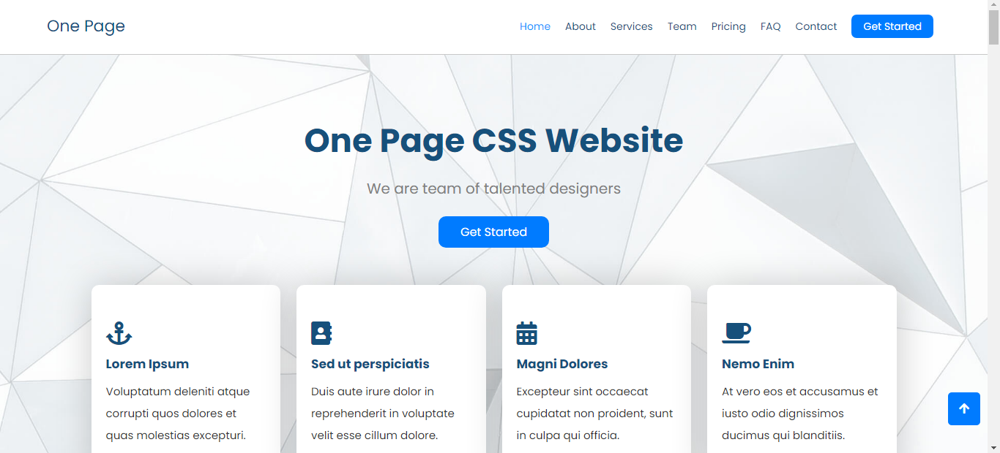
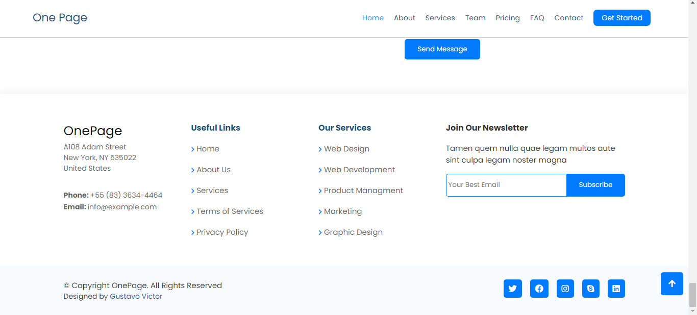
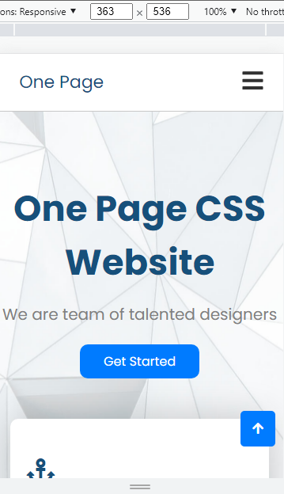
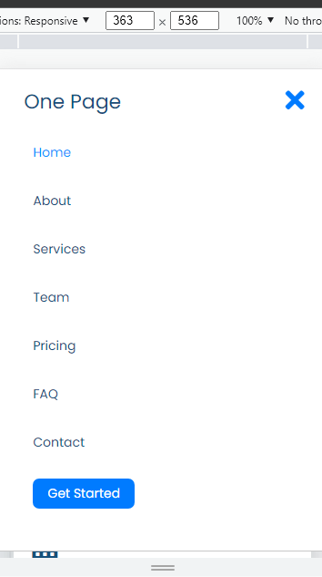
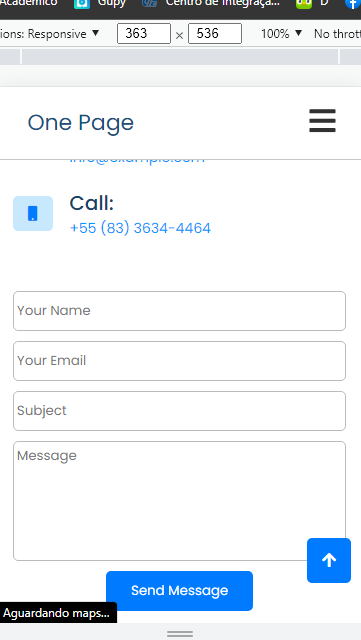

# One Page Website 📄

Full one page website based on a template

🚀Project Completed✅

## Table of contents

- [About](#-about)
- [Screenshots](#-screenshots)
   - [Desktop](#-desktop)
   - [Mobile](#-mobile)
- [Learnings](#-learnings)
- [Prerequisites](#-prerequisites)
- [How to Contribute](#-how-to-contribute)
- [Author](#-author)
- [License](#-license)

## 💻 About
This project is a complete one-page website made in HTML, CSS and JavaScript.
The purpose of this project is to train development skills in these languages. This site was based on a Bootstrap template available [at this link](https://bootstrapmade.com/demo/OnePage/) and also on some [Danki Code](https://www.youtube.com/c/DankiCode) YouTube channel lives. I would like to thank Danki Code a lot, because thanks to them I could learn a lot.
## 🎨 Screenshots

### Desktop / Laptop

### Mobile

To see the project hosted on Github Pages click on [this link](https://gustavo-victor.github.io/onePageWebsite/)

## 🗒️ Learnings

Over the course of the project, I could learn more about CSS transform effects, responsive design using Media Queries, FlexBox, responsive menu and also learn how to make FAQ section in JavaScript.

## 🚀 Prerequisites

To use and contribute to this project you just need basic knowledge of [HTML](https://developer.mozilla.org/pt-BR/docs/Web/HTML), [CSS](https://developer.mozilla.org/pt-BR/docs/Web/CSS), [JavaScript](https://www.javascript.com/) and [Git](https://git-scm.com/) plus a code editor like [Visual Studio Code](https://code.visualstudio.com/).
 
## 💪 How to Contribute 

1. Fork the project.

2. Create a new branch with your changes: `git checkout -b my-feature`

3. Save the changes and create a commit message telling you what you've done: `git commit -m "feature: My new feature"`

4. Submit your changes: `git push origin my-feature`

<!--
If you want more help with writing markdown, I'd recommend checking out [The Markdown Guide](https://www.markdownguide.org/) to learn more.
-->
## 🦸 Author

- GitHub - [@Gustavo-Victor](https://github.com/Gustavo-Victor)
- Frontend Mentor - [@Gustavo-Victor](https://www.frontendmentor.io/profile/Gustavo-Victor)
- CodePen - [@gustavo_victor](https://codepen.io/gustavo_victor)
- Linkedin - [@gustavo-victor](https://www.linkedin.com/in/gustavo-victor-575b93206/)

## 📝License

This project is under the [MIT license](./LICENSE).

Anyone can use, clone, fork and contribute to this project.

